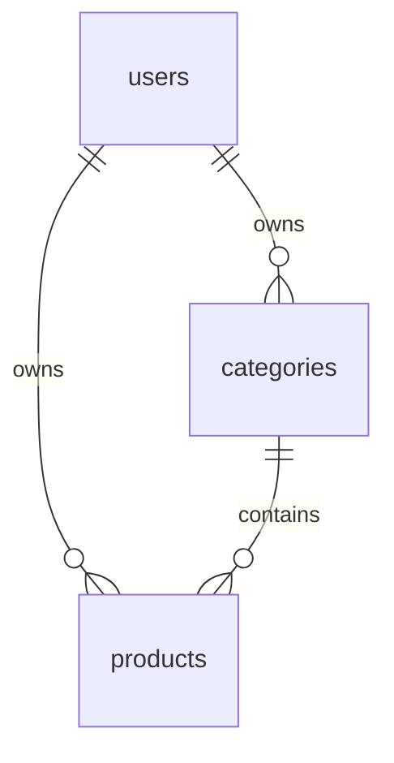
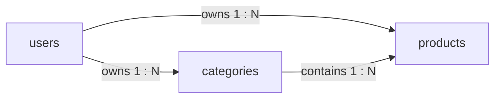
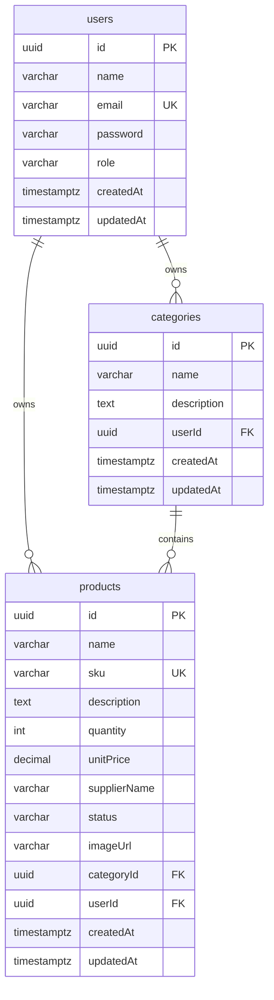

# Database schema

PostgreSQL database: `inventory_db`

Tables are created by TypeORM (`synchronize: true`) from the entities in `backend/src`. Column names below match what TypeORM stores (camelCase).

## Ownership diagram

Each inventory **user** owns their own categories and products. A category contains products. The owner role in the app is for user management only and does not own inventory rows.





## ER diagram (with columns)



A static copy is in [er-diagram.svg](er-diagram.svg).

## Relationships

| From | To | Relationship | Type | On delete |
| --- | --- | --- | --- | --- |
| `users` | `categories` | **owns** (`categories.userId`) | 1 to many | `CASCADE` |
| `users` | `products` | **owns** (`products.userId`) | 1 to many | `CASCADE` |
| `categories` | `products` | **contains** (`products.categoryId`) | 1 to many | `RESTRICT` |

- Each **user** has their own categories and products.
- A **product** must belong to one category owned by the same user.
- Deleting a **user** removes their categories and products.
- A **category** cannot be deleted while products still use it.

## Tables

### `users`

| Column | Type | Notes |
| --- | --- | --- |
| `id` | uuid | Primary key, generated |
| `name` | varchar | Required |
| `email` | varchar | Unique, login id |
| `password` | varchar | bcrypt hash (not returned in API) |
| `role` | varchar | `owner` or `user`. Default `user` |
| `createdAt` | timestamptz | Set by TypeORM |
| `updatedAt` | timestamptz | Set by TypeORM |

Rules:

- First registered account is promoted to `owner`.
- At least one `owner` must remain.

### `categories`

| Column | Type | Notes |
| --- | --- | --- |
| `id` | uuid | Primary key, generated |
| `name` | varchar | Required |
| `description` | text | Nullable |
| `userId` | uuid | FK → `users.id` |
| `createdAt` | timestamptz | Set by TypeORM |
| `updatedAt` | timestamptz | Set by TypeORM |

### `products`

| Column | Type | Notes |
| --- | --- | --- |
| `id` | uuid | Primary key, generated |
| `name` | varchar | Required |
| `sku` | varchar | Unique across the whole system |
| `description` | text | Nullable |
| `quantity` | int | Default `0`. Cannot go below 0 |
| `unitPrice` | decimal(10,2) | Must be greater than 0 |
| `supplierName` | varchar(120) | Nullable |
| `status` | varchar | Set by the API from quantity (not sent by the client) |
| `imageUrl` | varchar | Nullable. File stored under `backend/uploads` |
| `categoryId` | uuid | FK → `categories.id` |
| `userId` | uuid | FK → `users.id` |
| `createdAt` | timestamptz | Set by TypeORM |
| `updatedAt` | timestamptz | Set by TypeORM |

Stock status (derived from `quantity`):

| `quantity` | `status` |
| --- | --- |
| 0 | `Out of Stock` |
| 1–10 | `Low Stock` |
| 11+ | `In Stock` |

## Indexes and constraints

- PK: `users.id`, `categories.id`, `products.id`
- Unique: `users.email`, `products.sku`
- FK: `categories.userId` → `users.id` (`ON DELETE CASCADE`)
- FK: `products.userId` → `users.id` (`ON DELETE CASCADE`)
- FK: `products.categoryId` → `categories.id` (`ON DELETE RESTRICT`)

## Reference DDL

TypeORM creates these tables on startup. This is the equivalent SQL for reference (do not run it if the API is already using `synchronize`):

```sql
CREATE TABLE users (
  id uuid PRIMARY KEY DEFAULT gen_random_uuid(),
  name varchar NOT NULL,
  email varchar NOT NULL UNIQUE,
  password varchar NOT NULL,
  role varchar NOT NULL DEFAULT 'user',
  "createdAt" timestamptz NOT NULL DEFAULT now(),
  "updatedAt" timestamptz NOT NULL DEFAULT now()
);

CREATE TABLE categories (
  id uuid PRIMARY KEY DEFAULT gen_random_uuid(),
  name varchar NOT NULL,
  description text,
  "userId" uuid NOT NULL REFERENCES users(id) ON DELETE CASCADE,
  "createdAt" timestamptz NOT NULL DEFAULT now(),
  "updatedAt" timestamptz NOT NULL DEFAULT now()
);

CREATE TABLE products (
  id uuid PRIMARY KEY DEFAULT gen_random_uuid(),
  name varchar NOT NULL,
  sku varchar NOT NULL UNIQUE,
  description text,
  quantity int NOT NULL DEFAULT 0,
  "unitPrice" numeric(10, 2) NOT NULL,
  "supplierName" varchar(120),
  status varchar NOT NULL DEFAULT 'Out of Stock',
  "imageUrl" varchar,
  "categoryId" uuid NOT NULL REFERENCES categories(id) ON DELETE RESTRICT,
  "userId" uuid NOT NULL REFERENCES users(id) ON DELETE CASCADE,
  "createdAt" timestamptz NOT NULL DEFAULT now(),
  "updatedAt" timestamptz NOT NULL DEFAULT now()
);
```
